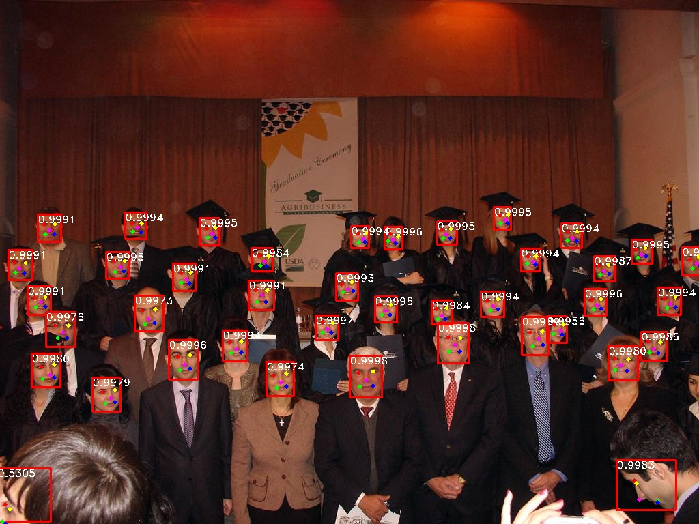

# Face_Recognization_Alog_System
人脸识别算法系统包含人脸检测训练推理算法、人脸矫正算法、人脸特征比对算法、人脸识别整体pipeline以及在tensorrt和安卓端的部署代码。

## 人脸识别各个模块以及运行
### 人脸检测Face_Detection
##### 环境安装
```Shell
cd Face_Detection 
pip install -r requirements.txt
```
##### 数据准备
1. 下载数据 [WIDERFACE](http://shuoyang1213.me/WIDERFACE/WiderFace_Results.html).

2. 下载标签(人脸标注框& 人脸五个关键点坐标标注) 从 [baidu cloud](https://pan.baidu.com/s/1Laby0EctfuJGgGMgRRgykA) 或者 [dropbox](https://www.dropbox.com/s/7j70r3eeepe4r2g/retinaface_gt_v1.1.zip?dl=0)

3. 将数据的文件夹格式改成下面的架构:

```Shell
  ./data/widerface/
    train/
      images/
      label.txt
    val/
      images/
      wider_val.txt
```
ps: wider_val.txt 仅包含 验证文件名不包含标签信息。

#### 训练
提供restnet50和 mobilenet0.25 做为预训练模型，下载路径为： [google cloud](https://drive.google.com/open?id=1oZRSG0ZegbVkVwUd8wUIQx8W7yfZ_ki1) and [baidu cloud](https://pan.baidu.com/s/12h97Fy1RYuqMMIV-RpzdPg) 密码: fstq .</br>
将下载好的模型放到对应的路径下：
```Shell
  ./weights/
      mobilenet0.25_Final.pth
      mobilenetV1X0.25_pretrain.tar
      Resnet50_Final.pth
```
1. 在训练前，修改配置文件：``data/config.py and train.py``。

2. 训练模型:
  ```Shell
  CUDA_VISIBLE_DEVICES=0,1,2,3 python train.py --network resnet50 or
  CUDA_VISIBLE_DEVICES=0 python train.py --network mobile0.25
  ```

#### 验证
### Evaluation widerface val
1. 生成txt文件
```Shell
python test_widerface.py --trained_model weight_file --network mobile0.25 or resnet50
```
2. 评估txt的结果. 参考 [Here](https://github.com/wondervictor/WiderFace-Evaluation)
```Shell
cd ./widerface_evaluate
python setup.py build_ext --inplace
python evaluation.py
```
<p align="center"></p>

#### TensorRT部署
-[TensorRT](https://github.com/wang-xinyu/tensorrtx/tree/master/retinaface)

### 人脸矫正Face_Alignment

#### 1. 安装依赖库

```shell
pip install numpy
pip install opencv-python
```

#### 2. 设置landmarks
根据自己的图像设置landmarks(五点定位)，第26行
```
face_landmarks
```
#### 3. 运行并查看结果
```
python face_alignment.py
```
结果如下：
<p align="center"></p>


### 人脸特征比对和人脸注册以及pipeline Face_Recognization_Pipeline
人脸特征比对模型采用预训练模型`models/arcface`
#### 1. 安装环境
```shell
cd Face_Recognization_Pipeline
pip install -r requirement.txt
```
#### 2. 人脸注册
修改配置文件：
``` python
def parse_opt():
    parser = argparse.ArgumentParser()
    # Retinaface args
    parser.add_argument('--retinaface_model_path', default='/codes/Face_Rec/models/mobilenet0_25.tflite',
                        help='Retinaface model path')
    parser.add_argument('--retinaface_backbone', default='mobilenet', help='Retinaface model backbone')
    parser.add_argument('--retinaface_threshold', type=float, default=0.7, help='Retinaface detect threshold')
    parser.add_argument('--retinaface_nms_iou', type=float, default=0.45, help='Retinaface nms iou threshold')
    parser.add_argument('--retinaface_input_shape', type=int, default=[640, 640, 3], help='Retinaface input shape')
    parser.add_argument('--retinaface_output_shape', type=int, default=[10, 2, 4], help='Retinaface model output shape')
    # FaceOperator args
    parser.add_argument('--euler_angle_threshold', default=30, type=float, help='Filter euler angle threshold')
    # Arcface args
    parser.add_argument('--arcface_model_path', default='/codes/Face_Rec/models/arcface.tflite',
                        help='Arcface model path')
    parser.add_argument('--arcface_input_shape', type=int, default=[112, 112, 3], help='Arcface model input size')
    parser.add_argument('--arcface_output_shape', type=int, default=[128], help='Arcface extract feature shape')
    # Register
    parser.add_argument('--register_csv_path', default='Face_Gallery/gallery_kuangbiao_pc.csv',
                        help='Face features gallery csv file')
    parser.add_argument('--register_images_path', default='Face_Gallery/face_images_kuangbiao',
                        help='Face images to register')
```
运行：
```shell
python Register_gallery_pc.py
```
#### 3. 人脸识别的pipeline 

运行：
```shell
python FaceRec_whole_process_pc.py
```

### 人脸识别的部署
#### 1. 安装环境
1. 基于硬件，安装tensorrt：https://docs.nvidia.com/deeplearning/tensorrt/install-guide/index.html#installing-tar
2. opencv 安装： `opencv build Flag : -D WITH_CUDNN=OFF -D OPENCV_DNN_CUDA=ON`
#### 2. 模型转换
```
cd Face_Recognization_Deploy 
cd prj_onnx2trt
python demo.py
```
#### 3. 模型验证
```
python calibrator.py
```
#### 4. 模型推理

```
cd .. && cd prj_tenorrt
python demo.py
```
结果如下：
<p align="center"></p>

